# WearZone

<div align="center">


### A modern Android fashion e-commerce application

Browse products, manage a wishlist and cart, receive AI-assisted recommendations, and complete orders through an end-to-end shopping experience.

[](https://kotlinlang.org/)
[](https://developer.android.com/)
[](https://developer.android.com/compose)
[](https://developer.android.com/tools/releases/platforms)
[](#architecture)
[](https://github.com/WearZone-ITI/WearZone/tags)

[Features](#-features) •
[Screenshots](#-screenshots) •
[Architecture](#-architecture) •
[Setup](#-getting-started) •
[Testing](#-testing) •
[Contributors](#-contributors)

</div>

---

## 📖 Project Overview

WearZone is a multi-module Android fashion shopping application built with Kotlin and Jetpack Compose. It provides catalog browsing, filtered search, product details, local-first cart and wishlist behavior, customer authentication, address management, checkout, order tracking, and an AI-powered shopping assistant.

The application integrates with Shopify for catalog and commerce operations, Firebase for authentication and synchronized user data, Paymob for card payments, Mapbox for address selection, and Groq for conversational shopping assistance and voice transcription.

### Project Information

| Property | Value |
|---|---|
| Application ID | `com.example.wearzone` |
| Platform | Android |
| Minimum SDK | 26 — Android 8.0 |
| Target SDK | 36 |
| Current version | `1.0` |
| Default branch | `develop` |
| Primary language | Kotlin |
| UI | Jetpack Compose and Material 3 |
| Java toolchain | Java 21 |
| Repository | [WearZone-ITI/WearZone](https://github.com/WearZone-ITI/WearZone) |

---

## ✨ Features

### Authentication and Onboarding

- Splash-screen routing and first-launch onboarding.
- Email and password registration and login.
- Google Sign-In through Firebase Authentication.
- Email verification and password reset.
- Guest access for public shopping features.
- Protected-route handling for authenticated-only operations.
- Firebase user profiles linked to Shopify customer records.

### Product Catalog

- Home feed with categories, brands, trending products, new arrivals, promotional content, and hero products.
- Browse Shopify custom and smart collections.
- Dedicated category, brand, and vendor product screens.
- Product cards with pricing, stock state, images, and wishlist controls.
- Product details with image carousel, size and color selection, variant availability, stock information, quantity handling, reviews, cart, and wishlist actions.

### Search and Filtering

- Debounced product search and suggested products.
- Recent searches stored locally.
- Brand, category, minimum-price, and maximum-price filters.
- Product, category, and vendor navigation from search results.
- Local catalog fallback when cached products are available.

### Cart and Wishlist

- Room-backed local cart with immediate updates.
- Quantity validation against available stock.
- Shared cart count across application screens.
- Shopify draft-order synchronization for authenticated customers.
- Room-backed offline wishlist with optimistic updates.
- Per-user wishlist separation and Firebase Realtime Database synchronization.
- Local data remains available when remote synchronization fails.

### Checkout and Orders

- Delivery-address selection.
- Promotional and discount-code validation.
- Cash on Delivery and Paymob card payments.
- Shopify order creation.
- Order history, order details, status, cancellation, and tracking information.

### Address Management

- View, create, edit, delete, and select a default customer address.
- Country selection and address validation.
- Mapbox address autocomplete and interactive map picker.
- Current-location detection, forward geocoding, and reverse geocoding.

### AI Shopping Assistant

- Catalog-grounded conversational shopping assistant.
- Real product cards inside chat responses.
- Natural-language product search, comparisons, and outfit recommendations.
- Brand, category, style, gender, color, material, and budget matching.
- English and Arabic query handling.
- Groq-hosted `llama-3.1-8b-instant` responses.
- Voice recording and transcription using `whisper-large-v3`.
- Local fallback responses when the language model is unavailable.

### Personalization and Accessibility

- English and Arabic localization with right-to-left support.
- System, light, and dark themes.
- Currency selection for EGP, USD, EUR, and GBP.
- Remote exchange-rate conversion.
- Locally persisted theme, language, currency, and notification preferences.
- Reusable dialogs and consistent loading, empty, offline, and error states.

### Offline and Background Behavior

- Cached home categories, brands, and products.
- Remote-first catalog loading with local fallback.
- Offline cart and wishlist access through Room.
- Local recent-search history.
- Coil memory and disk image caching.
- WorkManager-based promotional coupon notifications.


## 📱 Screenshots

<table align="center">
<tr>
<th align="center" width="25%">AI Style Onboarding</th>
<th align="center" width="25%">Arabic Dark Home</th>
<th align="center" width="25%">Search &amp; Filters</th>
<th align="center" width="25%">Product Details</th>
</tr>
<tr>
<td align="center" valign="top">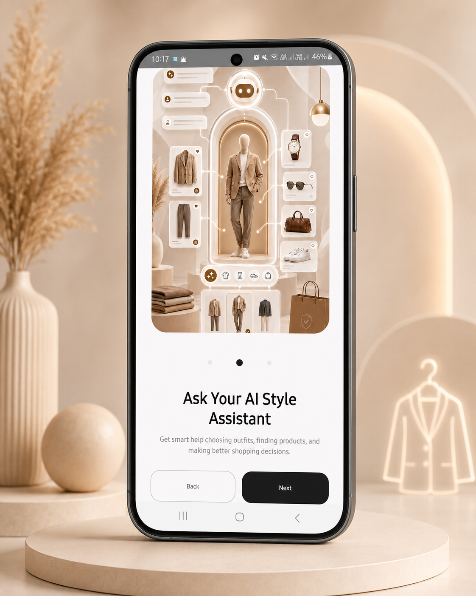</td>
<td align="center" valign="top">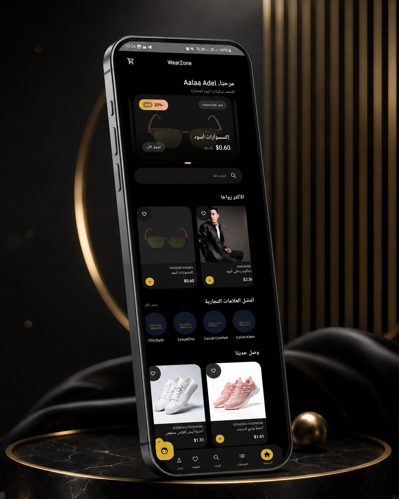</td>
<td align="center" valign="top">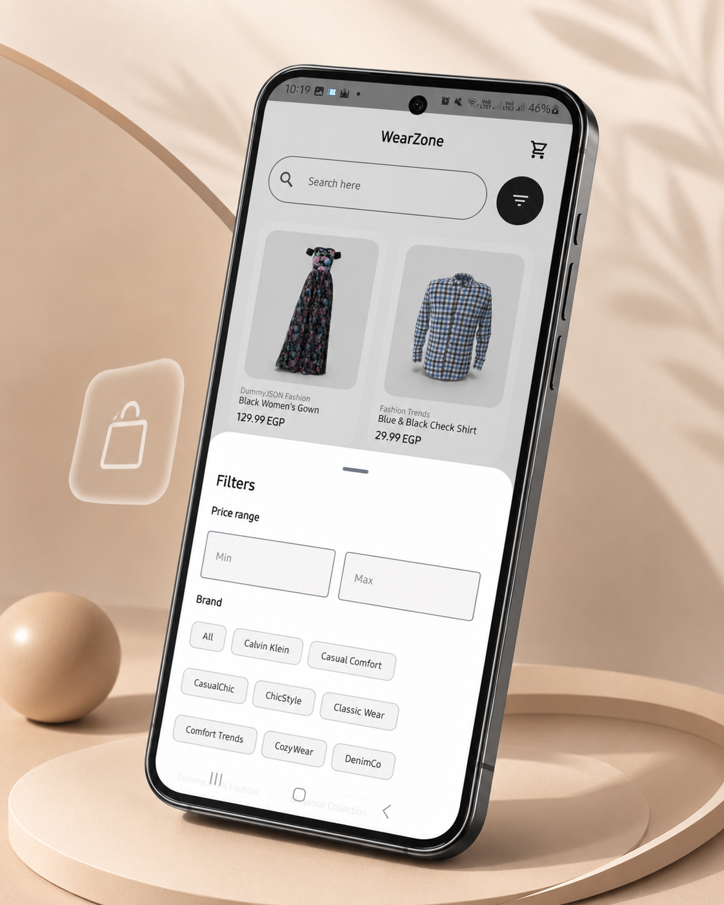</td>
<td align="center" valign="top">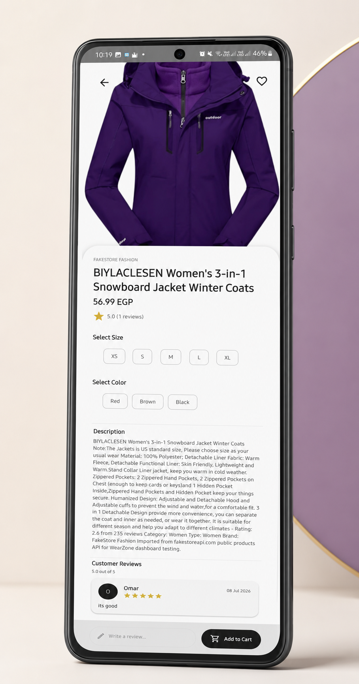</td>
</tr>
<tr>
<th align="center">AI Assistant</th>
<th align="center">Shopping Cart</th>
<th align="center">Checkout</th>
<th align="center">Paymob Payment</th>
</tr>
<tr>
<td align="center" valign="top">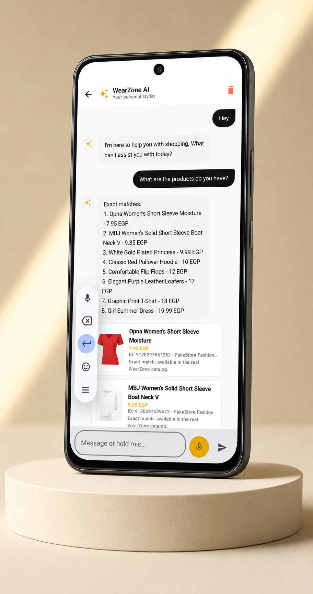</td>
<td align="center" valign="top">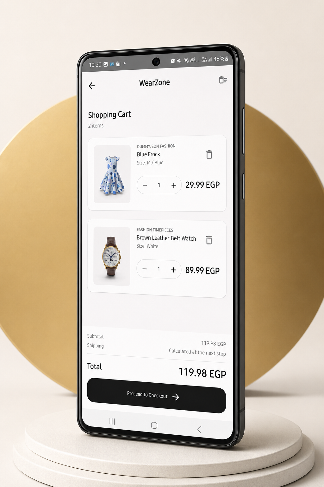</td>
<td align="center" valign="top">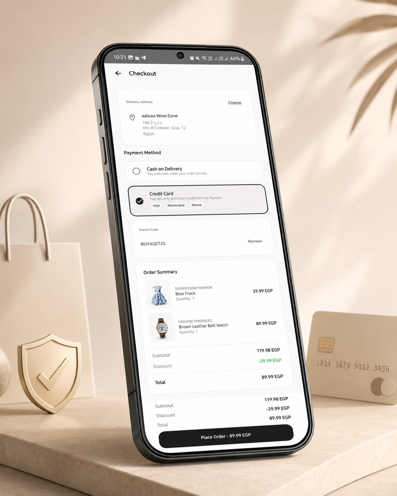</td>
<td align="center" valign="top">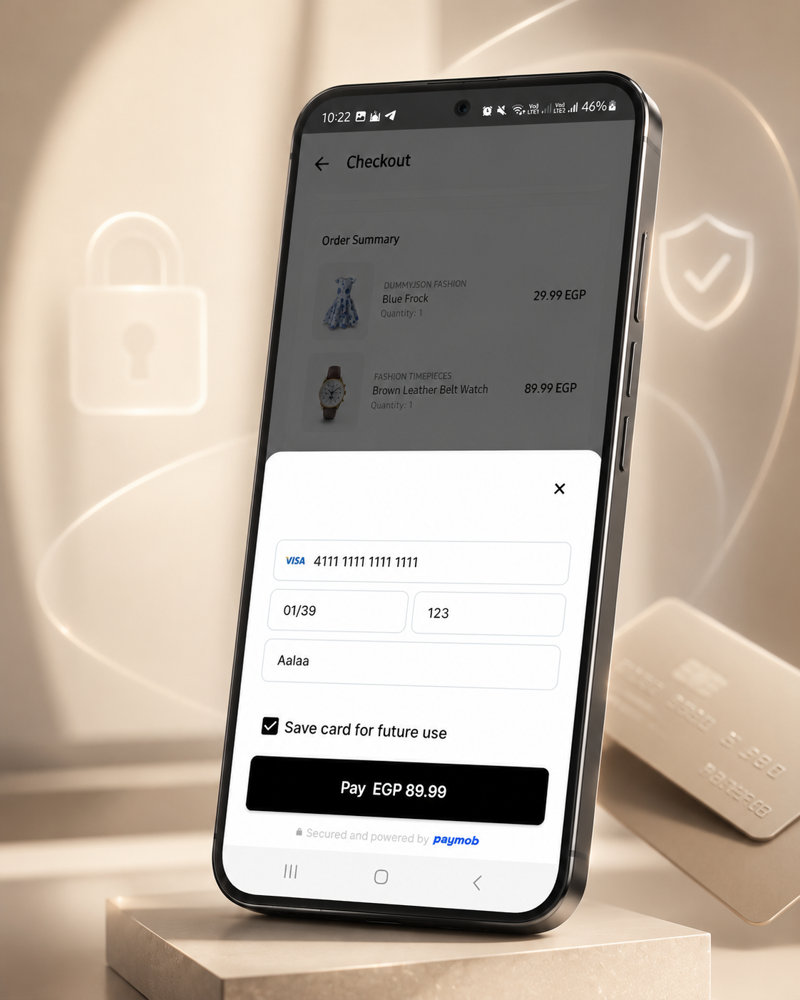</td>
</tr>
<tr>
<th colspan="2" align="center">Profile</th>
<th colspan="2" align="center">Settings</th>
</tr>
<tr>
<td colspan="2" align="center" valign="top">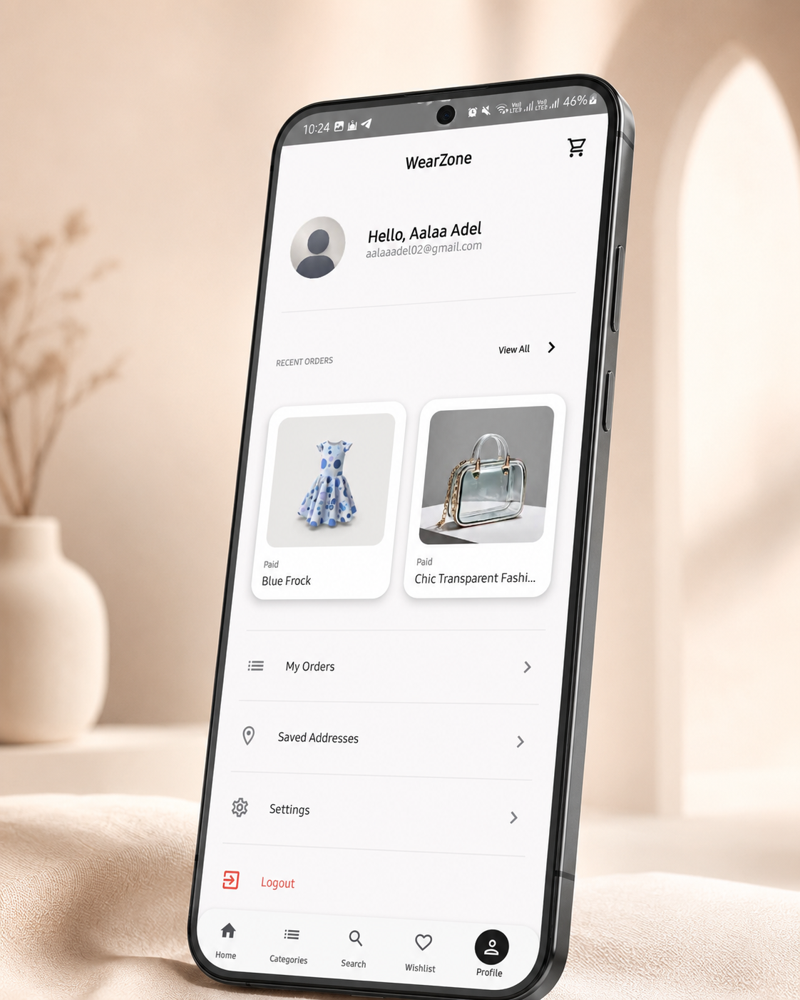</td>
<td colspan="2" align="center" valign="top">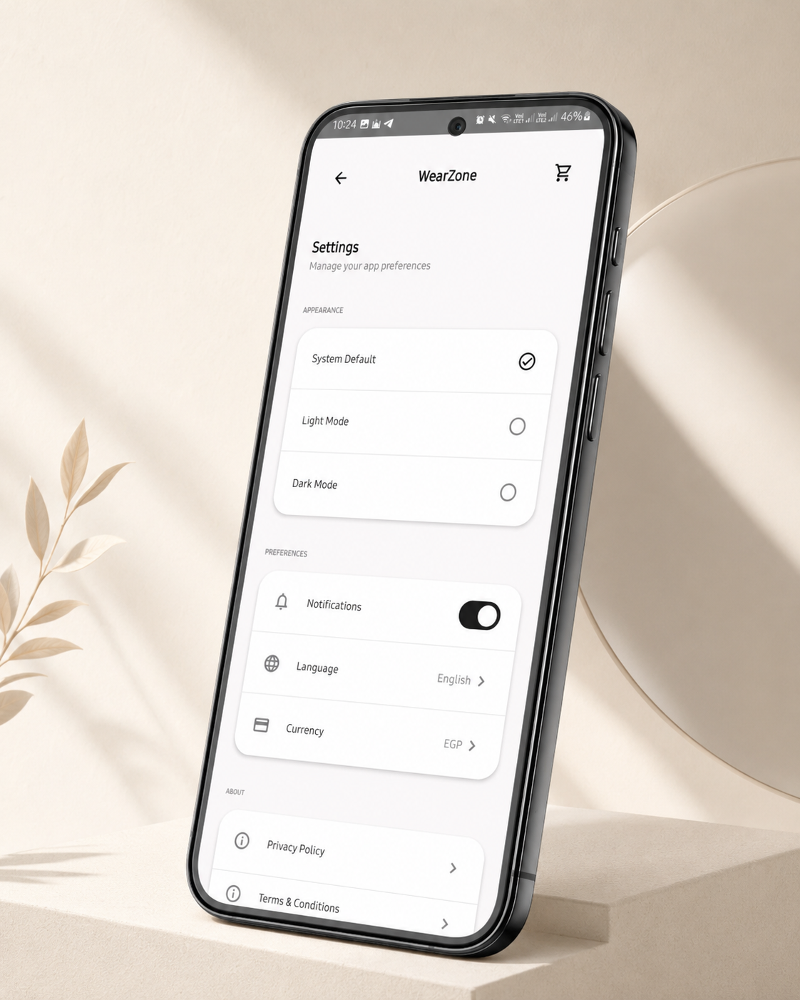</td>
</tr>

</table>

## 🛠️ Tech Stack

| Area | Technologies |
|---|---|
| Language | [Kotlin 2.2.10](https://kotlinlang.org/) |
| UI | [Jetpack Compose](https://developer.android.com/compose), [Material 3](https://m3.material.io/), Compose BOM |
| Architecture | Clean Architecture, MVI-style presentation, multi-module design |
| State management | StateFlow, Kotlin Flow, buffered Channels, immutable collections |
| Concurrency | Kotlin Coroutines |
| Dependency injection | [Hilt 2.60](https://developer.android.com/training/dependency-injection/hilt-android) |
| Annotation processing | KSP |
| Navigation | Type-safe Navigation Compose with Kotlin Serialization |
| Networking | Retrofit 3, OkHttp, Kotlinx Serialization, Gson |
| Database | [Room 2.8.4](https://developer.android.com/training/data-storage/room) |
| Preferences | [Preferences DataStore](https://developer.android.com/topic/libraries/architecture/datastore) |
| Authentication | Firebase Authentication and Google Sign-In |
| Cloud data | Firebase Firestore and Firebase Realtime Database |
| Commerce | Shopify Admin REST API and Shopify Admin GraphQL metafield requests |
| Payments | Paymob Android SDK and Intention API |
| Maps | Mapbox Maps SDK, Mapbox Geocoding API, Google Play Services Location |
| AI | Groq Chat Completions and Whisper transcription |
| Images and animation | Coil 3 and Lottie Compose |
| Background work | WorkManager with Hilt workers |
| Testing | JUnit 4, MockK, Turbine, Coroutines Test, Compose UI Test, Espresso |
| Build | Android Gradle Plugin 9.2.1, Gradle 9.4.1, Java 21 |

---

## 🧱 Architecture

WearZone follows Clean Architecture with four Gradle modules. The domain module defines the application rules, while presentation and data depend on its abstractions.

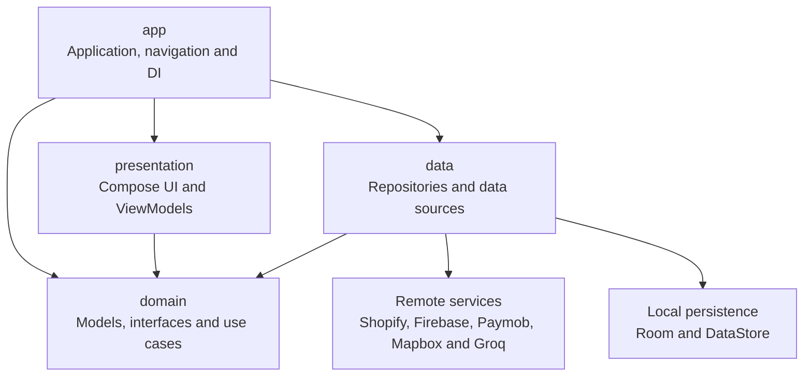

### Module Responsibilities

| Module | Responsibility |
|---|---|
| `app` | Application entry point, activities, type-safe navigation, Hilt modules, network configuration, and dependency wiring. |
| `presentation` | Compose screens, reusable components, ViewModels, UI states, intents, effects, themes, and localization resources. |
| `domain` | Framework-independent models, repository contracts, use cases, validation rules, and domain errors. |
| `data` | Repository implementations, data sources, DTOs, mappers, Room, DataStore, Firebase, Retrofit, and background workers. |

### Presentation Flow

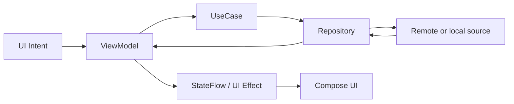

ViewModels expose observable state through `StateFlow` and one-time events through buffered `Channel` flows. Business operations are delegated to domain use cases, which depend on repository interfaces rather than concrete data implementations.

---

## 📂 Project Structure

```text
WearZone/
├── app/
│   └── src/main/
│       ├── kotlin/com/example/wearzone/
│       │   ├── di/                    # Hilt dependency modules
│       │   ├── localization/          # Application locale wrapper
│       │   ├── navigation/            # Type-safe navigation graph
│       │   ├── MainActivity.kt
│       │   └── WearZoneApplication.kt
│       └── res/                       # App resources and launcher assets
├── presentation/
│   └── src/main/
│       ├── kotlin/com/example/wearzone/presentation/
│       │   ├── address/               # Address list, form and map picker
│       │   ├── ai/chat/               # AI shopping assistant
│       │   ├── auth/                  # Login, registration and recovery
│       │   ├── cart/                  # Shopping cart
│       │   ├── checkout/              # Checkout and payment
│       │   ├── home/                  # Home catalog
│       │   ├── order/                 # Order history and details
│       │   ├── product/               # Product list and details
│       │   ├── search/                # Search and filtering
│       │   ├── settings/              # User preferences
│       │   └── wishlist/              # Saved products
│       └── res/                       # English, Arabic and animation resources
├── domain/
│   └── src/main/kotlin/com/example/wearzone/domain/
│       ├── model and feature packages
│       ├── repository interfaces
│       └── use cases
├── data/
│   └── src/main/kotlin/com/example/wearzone/data/
│       ├── db/                         # Room database
│       ├── local/                      # DAOs, entities and preferences
│       ├── notifications/              # WorkManager coupon reminders
│       ├── remote/                     # APIs, DTOs and data sources
│       └── repository/                 # Repository implementations
├── docs/                               # Plans and API collections
├── gradle/                             # Version catalog and wrapper
├── libs/                               # Local Paymob Maven artifact
├── build.gradle.kts
└── settings.gradle.kts
```

---

## 🚀 Getting Started

### Prerequisites

- [Android Studio](https://developer.android.com/studio) with support for AGP 9.2.1.
- Android SDK 36.
- JDK 21.
- Git.
- Firebase, Shopify, Mapbox, Groq, and Paymob credentials for the corresponding features.

### 1. Clone the Repository

```bash
git clone https://github.com/WearZone-ITI/WearZone.git
cd WearZone
git checkout develop
```

### 2. Configure Firebase

Create a Firebase Android application using the package name:

```text
com.example.wearzone
```

Enable Email/Password and Google authentication, Cloud Firestore, and Realtime Database. Download the Firebase configuration file and place it at:

```text
app/google-services.json
```

Add the SHA-1 and SHA-256 fingerprints of your debug and release certificates when using Google Sign-In.

### 3. Configure Local Properties

Create `local.properties` in the repository root:

```properties
sdk.dir=/absolute/path/to/Android/Sdk

SHOPIFY_ADMIN_TOKEN=your_shopify_admin_token
GROQ_API_KEY=your_groq_api_key

PAYMOB_SECRET_KEY=your_paymob_secret_key
PAYMOB_PUBLIC_KEY=your_paymob_public_key
PAYMOB_INTEGRATION_ID=your_paymob_integration_id

MAPBOX_ACCESS_TOKEN=your_public_mapbox_access_token
```

On Windows, escape backslashes or use forward slashes:

```properties
sdk.dir=C\:\\Users\\YourName\\AppData\\Local\\Android\\Sdk
```

### 4. Configure the Mapbox Downloads Token

Add the secret downloads token to your user-level Gradle properties file instead of committing it to the repository.

Linux and macOS: `~/.gradle/gradle.properties`

Windows: `%USERPROFILE%\.gradle\gradle.properties`

```properties
MAPBOX_DOWNLOADS_TOKEN=your_secret_mapbox_downloads_token
```

### 5. Configure Shopify

The Shopify base URL is defined in:

```text
app/src/main/kotlin/com/example/wearzone/di/NetworkModule.kt
```

Update `BASE_URL` if you are connecting the application to another Shopify store.

### 6. Build and Run

Linux or macOS:

```bash
chmod +x gradlew
./gradlew assembleDebug
```

Windows:

```powershell
gradlew.bat assembleDebug
```

Install the debug build on a connected device:

```bash
./gradlew installDebug
```

### 🔐 Security Notice

The current academic implementation places Shopify Admin and payment-service credentials in Android `BuildConfig` fields and calls Shopify Admin endpoints from the application. This is not safe for production because secrets can be extracted from an APK.

Before publishing the application:

- Move Shopify Admin API operations to a protected backend or Backend-for-Frontend.
- Keep Paymob secret and Groq credentials on the server.
- Use Shopify Storefront APIs from the mobile client where appropriate.
- Never commit `local.properties`, private keys, service credentials, or signing files.

---

## 🌐 APIs and Services

| Service | Purpose | Current Usage |
|---|---|---|
| [Shopify](https://shopify.dev/docs/api) | Products, collections, customers, addresses, discounts, draft orders, and orders | Admin REST API `2024-04` and an Admin GraphQL metafield request |
| [Firebase Authentication](https://firebase.google.com/docs/auth/android/start) | Email/password authentication, Google Sign-In, verification, and password reset | Authentication provider |
| [Cloud Firestore](https://firebase.google.com/docs/firestore) | Shopify customer mapping and product reviews | User and review documents |
| [Firebase Realtime Database](https://firebase.google.com/docs/database) | Wishlist synchronization | Per-user wishlist data |
| [Paymob](https://developers.paymob.com/) | Credit-card payment processing | Android SDK and payment intention API |
| [Mapbox](https://docs.mapbox.com/android/maps/guides/) | Maps, address search, selection, and reverse geocoding | Maps SDK and Geocoding API |
| [Groq](https://console.groq.com/docs/overview) | AI shopping-assistant responses | Chat Completions API |
| [Whisper on Groq](https://console.groq.com/docs/speech-to-text) | Voice-message transcription | Audio transcription endpoint |
| [ExchangeRate API](https://www.exchangerate-api.com/docs/free) | Currency conversion | Rates loaded from `open.er-api.com` |

---

## 💾 Local Storage

| Storage | Data |
|---|---|
| Room `products` | Basic locally stored product records |
| Room `home_cache` | Serialized home categories, brands, and products |
| Room `cart_items` | Cart items, variants, quantities, prices, and stock limits |
| Room `wishlist_table` | Per-user wishlist items |
| Room `recent_searches` | The eight most recent search queries |
| Preferences DataStore | Theme, notifications, language, currency, Shopify customer ID, and draft-order ID |
| Preferences DataStore | Onboarding-completion state |
| Coil cache | Previously loaded product and catalog images |

The catalog uses a remote-first strategy for primary home content and falls back to cached Room data when requests fail. Cart and wishlist changes are applied locally first, allowing the interface to remain usable while synchronization is unavailable.

---

## 🧪 Testing

The repository contains tests across the domain, data, and presentation layers.

### Current Test Coverage Areas

- Authentication use cases and repository behavior.
- Login, registration, and access-state handling.
- Product list and product-detail ViewModels.
- Cart, checkout, wishlist, and search behavior.
- Address lookup and address ViewModel behavior.
- Settings, localization preferences, and onboarding.
- Order history, order details, cancellation, and discount codes.
- Profile and brand screens.
- Coroutine and StateFlow behavior through test dispatchers.

### Testing Libraries

- JUnit 4.
- MockK.
- Turbine.
- `kotlinx-coroutines-test`.
- Compose UI Test.
- Espresso.

### Run Unit Tests

```bash
./gradlew test
```

Run a specific module:

```bash
./gradlew :domain:test
./gradlew :data:test
./gradlew :presentation:test
```

### Run Instrumented Tests

Connect an emulator or physical device, then run:

```bash
./gradlew connectedAndroidTest
```

---

## 👥 Contributors

| Contributor | GitHub |
|---|---|
| Hend Sayed | [@Hendsayed25](https://github.com/Hendsayed25) |
| Aalaa Adel | [@Aalaa-Adel](https://github.com/Aalaa-Adel) |
| Ahmed Tayseer | [@soutAhmedTayseer](https://github.com/soutAhmedTayseer) |
| Omar Ramadan | [@OmarRamadan20](https://github.com/OmarRamadan20) |


See the complete [contributors history](https://github.com/WearZone-ITI/WearZone/graphs/contributors).

---

## 🔮 Future Improvements

- Move Shopify Admin, Paymob secret, and Groq operations behind a secure backend.
- Replace deprecated Shopify API versions with supported Storefront or server-side APIs.
- Add development, staging, and production build variants.
- Add GitHub Actions for build, lint, and test automation.
- Increase Compose UI and end-to-end test coverage.
- Add release signing, minification, and resource shrinking.
- Improve offline synchronization and conflict resolution.
- Replace generated ratings with aggregates calculated from real customer reviews.
- Add pagination and incremental loading for large catalogs.
- Add crash reporting, performance monitoring, and privacy-safe analytics.
- Add tablet and landscape layouts.

---

## 📄 License

This repository does not currently contain a license file.

Unless a license is explicitly added, no permission is granted to copy, modify, redistribute, or use the source code outside the terms authorized by the project maintainers. Contact the WearZone team before reusing the project.

---

## 📬 Contact

For bugs, feature requests, or technical discussions:

- Open a [GitHub issue](https://github.com/WearZone-ITI/WearZone/issues).
- Visit the [WearZone ITI organization](https://github.com/WearZone-ITI).
- Review the [project repository](https://github.com/WearZone-ITI/WearZone).

---

<div align="center">

Built with Kotlin, Jetpack Compose, and a suspicious amount of coffee ☕️

**WearZone ITI Final Project**

<sub>Repository implementation reviewed on July 12, 2026.</sub>

</div>
